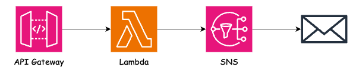
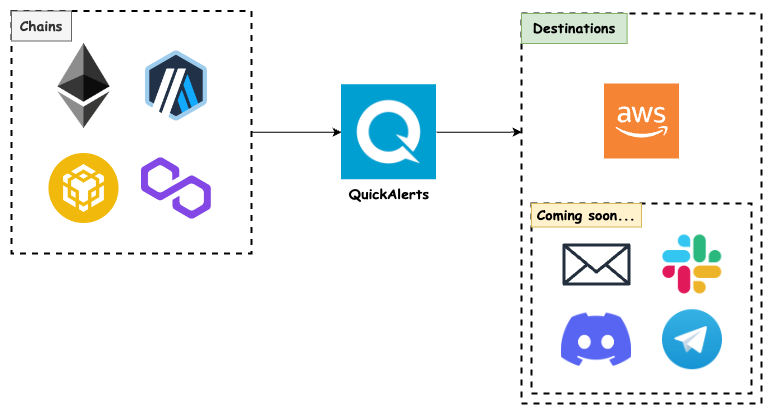

# aws-lambda-sns-poc

This project contains source code and supporting files for a serverless application that you can deploy with the [AWS Serverless Application Model (AWS SAM)](https://docs.aws.amazon.com/serverless-application-model/latest/developerguide/serverless-getting-started.html) command line interface (CLI).

The serverless application consists of the following AWS resources:

- [Amazon API Gateway](https://aws.amazon.com/api-gateway/)
- [AWS Lambda](https://aws.amazon.com/lambda/)
- [Amazon SNS](https://aws.amazon.com/sns/)

A **post endpoint** is exposed through **API Gateway**, which then triggers the **Lambda function**.

The **Lambda function** then publishes a message to an **SNS topic** that will **email** subscribers.

> **Note:** The sample application is configured as a **webhook** for [QuickNode QuickAlerts](https://www.quicknode.com/guides/quicknode-products/quickalerts/an-overview-of-quicknodes-quickalerts).
>
> This sends an email based on real-time blockchain events.

## Using the AWS SAM CLI

Follow the [official AWS documentation](https://docs.aws.amazon.com/serverless-application-model/latest/developerguide/serverless-getting-started.html) to setup AWS SAM CLI.

After installing, make sure to configure your AWS credentials by following this [guide](https://docs.aws.amazon.com/serverless-application-model/latest/developerguide/using-sam-cli-configure.html#using-sam-cli-configure-basic).

### Development and Deployment

Run the following commands:

1. `sam build`
2. `sam deploy`

After the initial deployment, you can quickly sync code and infrastructure changes by running `sam sync`.

## Resources

- [AWS Serverless Application Model (AWS SAM)](https://docs.aws.amazon.com/serverless-application-model/latest/developerguide/serverless-getting-started.html)
- [Amazon API Gateway](https://aws.amazon.com/api-gateway/)
- [AWS Lambda](https://aws.amazon.com/lambda/)
- [Amazon SNS](https://aws.amazon.com/sns/)
- [QuickNode QuickAlerts](https://www.quicknode.com/guides/quicknode-products/quickalerts/an-overview-of-quicknodes-quickalerts)
